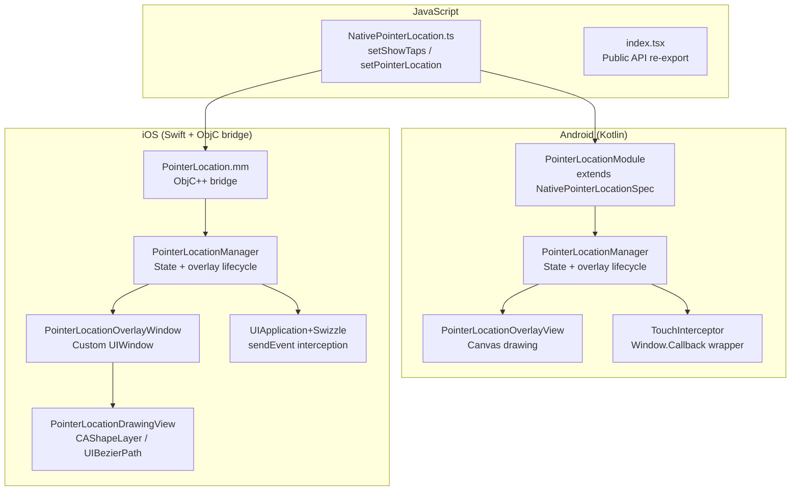

# Pointer Location TurboModule Library

## Architecture Overview



## File Changes

### Files to modify
- [`src/NativePointerLocation.ts`](src/NativePointerLocation.ts) -- Replace `multiply` spec with `setShowTaps(enabled: boolean): void` and `setPointerLocation(enabled: boolean): void`
- [`src/index.tsx`](src/index.tsx) -- Re-export `setShowTaps` and `setPointerLocation` directly
- [`ios/PointerLocation.h`](ios/PointerLocation.h) -- Update ObjC interface to match new spec
- [`ios/PointerLocation.mm`](ios/PointerLocation.mm) -- Bridge calls to Swift `PointerLocationManager`
- [`android/src/main/java/com/pointerlocation/PointerLocationModule.kt`](android/src/main/java/com/pointerlocation/PointerLocationModule.kt) -- Implement `setShowTaps` / `setPointerLocation`, delegate to manager
- [`PointerLocation.podspec`](PointerLocation.podspec) -- Add `s.swift_version = "5.0"`
- [`example/src/App.tsx`](example/src/App.tsx) -- Demo UI with toggle buttons

### Files to create
- **Android:**
  - `android/src/main/java/com/pointerlocation/PointerLocationManager.kt` -- Singleton managing overlay attach/detach lifecycle
  - `android/src/main/java/com/pointerlocation/PointerLocationOverlayView.kt` -- Custom View with Canvas drawing
- **iOS:**
  - `ios/PointerLocationManager.swift` -- Singleton managing overlay window lifecycle
  - `ios/PointerLocationOverlayWindow.swift` -- Custom UIWindow (non-interactive, high windowLevel)
  - `ios/PointerLocationDrawingView.swift` -- UIView subclass for all drawing

### Files to delete
- [`src/multiply.tsx`](src/multiply.tsx) and [`src/multiply.native.tsx`](src/multiply.native.tsx) -- No longer needed

---

## 1. TypeScript Spec and Public API

**`src/NativePointerLocation.ts`** -- Two void methods, no return values needed:

```typescript
import { TurboModuleRegistry, type TurboModule } from 'react-native';

export interface Spec extends TurboModule {
  setShowTaps(enabled: boolean): void;
  setPointerLocation(enabled: boolean): void;
}

export default TurboModuleRegistry.getEnforcing<Spec>('PointerLocation');
```

**`src/index.tsx`** -- Thin wrappers calling the native module:

```typescript
import PointerLocation from './NativePointerLocation';

export function setShowTaps(enabled: boolean): void {
  PointerLocation.setShowTaps(enabled);
}

export function setPointerLocation(enabled: boolean): void {
  PointerLocation.setPointerLocation(enabled);
}
```

---

## 2. Android Implementation (Kotlin)

### Touch Interception Strategy
- Wrap `activity.window.callback` with a custom `Window.Callback` that intercepts `dispatchTouchEvent`
- The wrapper extracts `MotionEvent` data (x, y, pressure, size, pointer count) and forwards to the overlay view, then delegates to the original callback so touches pass through normally
- Use `VelocityTracker` for Xv/Yv computation

### Overlay Strategy
- Add `PointerLocationOverlayView` to `activity.window.decorView` (a FrameLayout) as the topmost child
- View is non-clickable, non-focusable -- purely a drawing surface
- `MATCH_PARENT` layout so it covers the entire screen

### `PointerLocationManager.kt` (singleton)
- Holds `isShowTapsEnabled` and `isPointerLocationEnabled` booleans
- `attach()`: adds overlay view to DecorView + installs callback wrapper
- `detach()`: removes overlay view + restores original callback
- Logic: attach when either flag is true; detach when both are false

### `PointerLocationOverlayView.kt`
- Extends `View`, overrides `onDraw(canvas: Canvas)`
- Conditionally draws based on state booleans:
  - **Show Taps**: semi-transparent white circle (radius ~24dp) at each active pointer, with fade-out animation on UP
  - **Pointer Location**: yellow crosshair lines spanning full screen, blue gesture path (`Path` object), black data bar at top with white text (P, X, Y, Xv, Yv, Prs, Size)
- `updateTouchData(event: MotionEvent)` method called from the callback wrapper, updates internal state and calls `invalidate()`

### `PointerLocationModule.kt`
- `setShowTaps(enabled: Boolean)` and `setPointerLocation(enabled: Boolean)` run on UI thread via `currentActivity?.runOnUiThread`
- Delegate to `PointerLocationManager`

---

## 3. iOS Implementation (Swift + ObjC Bridge)

### Touch Interception Strategy
- Swizzle `UIApplication.sendEvent(_:)` once on first enable
- In the swizzled implementation: extract all `UITouch` objects from the event, read phase/location/force/majorRadius, forward data to `PointerLocationManager`, then call the original `sendEvent`
- This captures all touches globally without consuming them

### Overlay Strategy
- `PointerLocationOverlayWindow` is a `UIWindow` subclass:
  - `windowLevel = .statusBar + 100` (above everything)
  - `isUserInteractionEnabled = false` (pass-through)
  - `backgroundColor = .clear`
  - Has a transparent root `UIViewController` containing `PointerLocationDrawingView`
- Made visible via `makeKeyAndVisible()` on attach, set `isHidden = true` on detach

### `PointerLocationManager.swift` (singleton)
- Holds `isShowTapsEnabled` and `isPointerLocationEnabled`
- Manages overlay window lifecycle (create on first use, show/hide based on flags)
- Installs swizzle once, directs touch data to drawing view
- `processTouches(_ touches: Set<UITouch>)` extracts coordinates, pressure, radius, computes velocity from position deltas and timestamps

### `PointerLocationDrawingView.swift`
- UIView subclass with custom `draw(_ rect:)` or layer-based approach
- **Show Taps**: draws white semi-transparent circles at active touch points, with `UIView.animate` fade-out on touch end
- **Pointer Location**: draws yellow crosshair lines via `UIBezierPath`, blue stroke path following gesture, and a black data bar `UILabel` pinned to top of screen

### ObjC Bridge (`PointerLocation.mm`)
- Imports Swift via `#import "PointerLocation-Swift.h"`
- `setShowTaps:` and `setPointerLocation:` call `[[PointerLocationManager shared] setShowTapsEnabled:]` etc.
- Dispatches to main queue via `dispatch_async(dispatch_get_main_queue(), ...)`

### Podspec
- Add `s.swift_version = "5.0"` so CocoaPods compiles Swift sources

---

## 4. Visual Design (matching Android system style)

| Element | Color | Details |
|---------|-------|---------|
| Tap dot | White, 50% opacity | ~24dp radius, fades out over 200ms |
| Crosshair | Yellow (#FFFF00), 1px | Full screen width + height |
| Gesture path | Blue (#4169E1), 2px stroke | Cleared on touch end |
| Data bar | Black, 80% opacity, 32dp tall | White text, 11sp monospace |

---

## 5. Example App

Update [`example/src/App.tsx`](example/src/App.tsx) with two toggle buttons ("Show Taps" and "Pointer Location") that call `setShowTaps()` and `setPointerLocation()` respectively.
