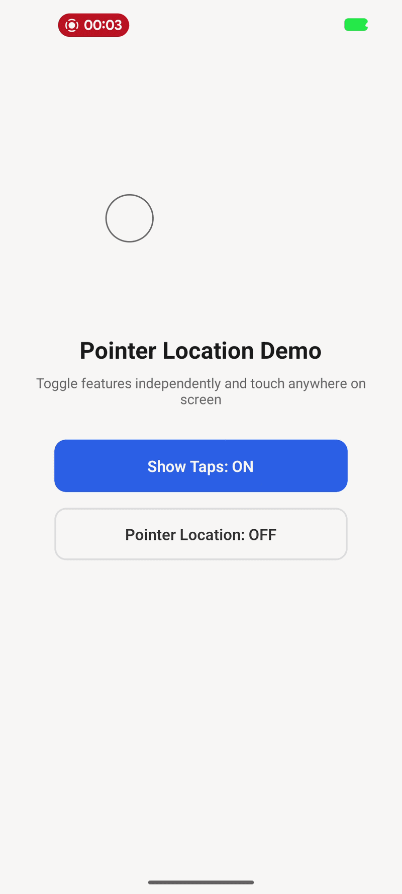
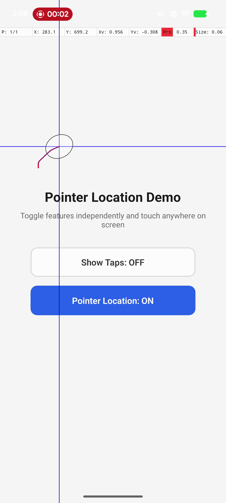

# react-native-pointer-location

A React Native library that replicates Android's built-in **"Show Taps"** and **"Pointer Location"** developer options on both Android and iOS.

All drawing and touch interception happens entirely in native code (Kotlin/Swift) via a global overlay — no Fabric Views, no JS bridge overhead. The overlay is non-interactive: all touches pass through to your app.

## Demo

| Show Taps | Pointer Location |
|:-:|:-:|
|  |  |

## Features

### Show Taps
- White semi-transparent circle with a dark stroke at each active touch point
- Fade-out animation on finger release
- Multi-touch support

### Pointer Location
- **Data bar** below the status bar with real-time touch metrics:
  - **P** — active/max pointer count
  - **X / dX** — X position while touching, delta from start after release
  - **Y / dY** — Y position while touching, delta from start after release
  - **Xv** — X velocity (pixels/millisecond)
  - **Yv** — Y velocity (pixels/millisecond)
  - **Prs** — pressure (Android always, iOS only on 3D Touch devices)
  - **Size** — normalized contact area size
- **Blue crosshair lines** spanning the full screen at the primary touch point
- **Velocity-colored gesture path** — red (slow) → blue (fast), per finger
- **Touch contact area indicator** — rotated ellipse on Android, circle on iOS
- Multi-finger path drawing

### General
- Both features toggle independently
- Global overlay renders above all app content (modals, navigation bars)
- Pass-through touches — your app functions normally underneath
- Smart resource management — overlay and listeners are attached only when needed
- Safe area aware — handles notches, cutouts, and orientation changes
- Supports both old and new React Native architectures

## Installation

```bash
npm install react-native-pointer-location
# or
yarn add react-native-pointer-location
```

### iOS

```bash
cd ios && pod install
```

### Android

No additional setup needed — auto-linking handles everything.

## Usage

```typescript
import { setShowTaps, setPointerLocation } from 'react-native-pointer-location';

// Enable show taps
setShowTaps(true);

// Enable pointer location
setPointerLocation(true);

// Disable
setShowTaps(false);
setPointerLocation(false);
```

### Development-only Usage

Since this is primarily a development tool, you can guard it with `__DEV__`:

```typescript
import { setShowTaps, setPointerLocation } from 'react-native-pointer-location';

if (__DEV__) {
  setShowTaps(true);
  setPointerLocation(true);
}
```

In production builds, Metro replaces `__DEV__` with `false` and the minifier strips the dead code. The native module is never accessed, so there is zero runtime cost.

## API

### `setShowTaps(enabled: boolean): void`

Enable or disable the "Show Taps" visual indicator. Draws a circle at every active touch point.

### `setPointerLocation(enabled: boolean): void`

Enable or disable the "Pointer Location" developer overlay. Renders the data bar, crosshairs, gesture path, and touch area indicator.

## Platform Differences

| Feature | Android | iOS |
|---|---|---|
| Pressure (Prs) | Always available | Only on 3D Touch devices (iPhone 6s–XS). Column is hidden on newer devices. |
| Touch area shape | Rotated ellipse (uses `touchMajor`, `touchMinor`, `orientation`) | Circle (iOS only provides `majorRadius`, no orientation for finger touches) |
| Touch interception | `Window.Callback` wrapping | `UIApplication.sendEvent` method swizzling |
| Overlay mechanism | View added to `DecorView` with max elevation | `UIWindow` with high `windowLevel` |

## Architecture Support

This library supports both React Native architectures:

- **New Architecture** (TurboModules) — uses codegen-generated specs
- **Old Architecture** (Bridge) — uses `NativeModules` / `RCT_EXPORT_METHOD`

No configuration needed — it auto-detects the architecture at runtime.

## How It Works

### Android
1. `PointerLocationModule` receives JS calls and dispatches to `PointerLocationManager` on the UI thread
2. `PointerLocationManager` injects a `PointerLocationOverlayView` into the Activity's `DecorView`
3. A `Window.Callback` wrapper intercepts `dispatchTouchEvent` to forward `MotionEvent` data to the overlay
4. `PointerLocationOverlayView` draws everything using Android's `Canvas` API in `onDraw`

### iOS
1. `PointerLocation.mm` bridges JS calls to the Swift `PointerLocationManager` via the main queue
2. `PointerLocationManager` creates a `PointerLocationOverlayWindow` with a high `windowLevel`
3. Method swizzling on `UIApplication.sendEvent(_:)` intercepts all touch events globally
4. `PointerLocationDrawingView` draws everything using Core Graphics in `draw(_:)`

## License

MIT
